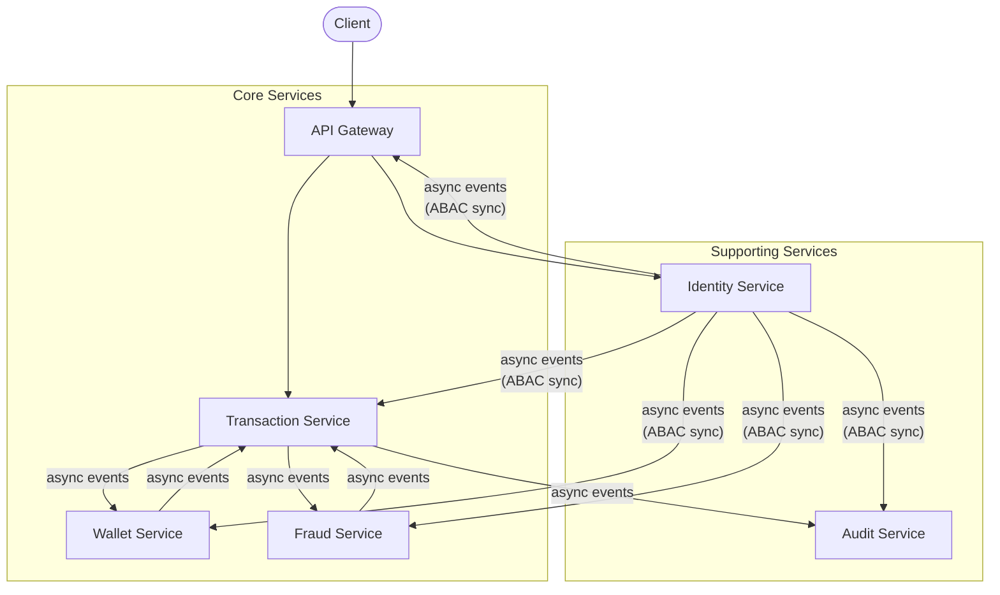

# Ciphernance

A deliberately overengineered payment engine core — built for learning distributed systems architecture.

## What this is

Ciphernance is a payment engine laboratory — not a product. It emulates the core of a financial transaction system: authorization, transfers, fraud analysis, and auditability. Built intentionally with overengineering to explore Event-Driven Architecture, ABAC, Choreography-based Saga, and Event Sourcing in practice. Inspired by how real payment processors like Stripe, Nubank, and Adyen architect their systems internally.

## Architecture

## Services

| Service | Responsibility |
|---|---|
| api-gateway | Entry point — JWT validation, ABAC enforcement (PEP), rate limiting, routing |
| identity-service | Source of truth for identities, accounts, and ABAC policies (PAP + PIP) |
| transaction-service | Orchestrates the transfer Saga, owns Event Sourcing for transaction state |
| wallet-service | Manages account balances — reserves funds during Saga, finalizes debit/credit |
| fraud-service | Pattern analysis via Redis rules and Neo4J relationship graphs |
| audit-service | Immutable event history — consumes all authorization and business events |

## Tech Stack

| Layer | Technology |
|---|---|
| Language | Java 21 |
| Framework | Spring Boot 4 |
| Gateway | Spring Cloud Gateway |
| IAM | Spring Authorization Server + JWT |
| Messaging | Apache Kafka |
| Database | PostgreSQL (per service) |
| Graph | Neo4J (Fraud Service) |
| Cache | Caffeine L1 + Redis L2 (Policy Agent per service) |
| Observability | Micrometer + Prometheus + Grafana |

## Current Status

Under active development.

- [x] Monorepo structure and ADRs
- [x] Docker Compose infrastructure
- [x] Identity Service — domain layer (User, Account, events, ports)
- [ ] Identity Service — application layer (Use Cases)
- [ ] Identity Service — infrastructure layer (JPA, Kafka, Spring Security)
- [ ] API Gateway
- [ ] Wallet Service
- [ ] Transaction Service
- [ ] Fraud Service
- [ ] Audit Service

## Design Decisions

See [`/docs/adr`](./docs/adr) for the full records.

- **Choreography-based Saga** — no central orchestrator; services react to and emit events autonomously
- **Eventually Consistent Authorization** — each service runs a local Policy Agent with ABAC; Identity Service distributes policy updates via Kafka
- **YAML ABAC policies** — human-readable DSL versioned in `/policies`, compiled and distributed at runtime
- **Event Sourcing scoped to Transaction Service** — transaction state is the sum of its events; no other service uses this pattern
- **UUID v7** — time-ordered identifiers for natural sort and indexing without sacrificing uniqueness

---

Built by Pablo Tzeliks
